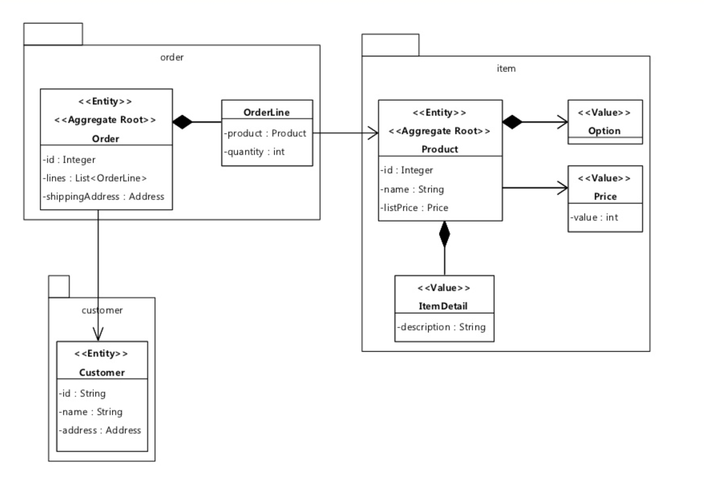

## DDD(Domain-driven design) Aggregate

aggregate는 DDD의 패턴이다.
aggregate는 single unit로 처리할 수 있는 도메인 객체들의 클러스터다.
하나의 예로는 order과 order line이 있을 수 있으며, 이것들은 별도의 개체가 될 수 있지만, 단일 aggregate로 취급하는 것이 유용하다.

aggregate는 그 구성요소 객체 중 하나가 aggregate root가 된다.
aggregate 밖과의 참조는 오직 aggregate root를 통해야한다. 
따라서 root는 전체의 무결성을 보장 할 수 있습니다.

aggregate는 데이터 저장소 전송의 기본 요소입니다. 
전체 aggregate를 로드하거나 저장하도록 요청합니다. 트랜잭션은 aggregate 경계를 넘지 않아야합니다.
> https://martinfowler.com/bliki/DDD_Aggregate.html

